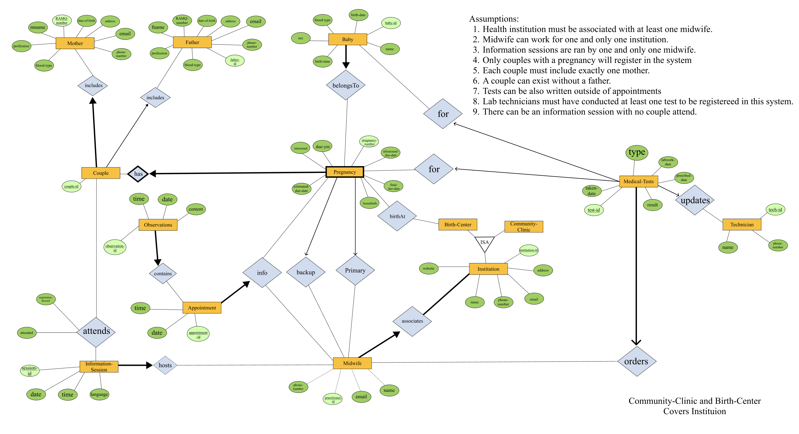

# Sages-Femmes du Quebec Database System

A database system for midwives program in Quebec. 

## INTRODUCTION

This database application aims to serve midwives' side of data input and processing. A midwife can use this application to review information related to appointments with expecting parents. They can check all notes, and medical tests related to the parents, add new notes for a certain appointment, or prescribe medical tests for the mother.

## WORKFLOW

- Design the database using [Entity Relationship Model](asset/ER.png)
- Translate the ER into [Relational Model](asset/Relational-Model.md)
- [Set up DB2 database locally](asset/db2-setup.md) using Docker
- [Implement](sql/createtbl.sql) the Design using IBM-DB2
- [Inject testing data](sql/loaddata.sql) into the database
- [Perform advanced queries](sql/queries.sql) to test the design of the database
- [Develop a CLI](application/SagesFemmes.java) using Java Database Connectivity (JDBC)

## ENTITY RELATIONSHIP MODEL

## RELATIONAL MODEL

- Mother (**<u>RAMQNum</u>**, mname, email, phone, dob, address, profession, bloodtype)
- Father (**<u>fatherID</u>**, fname, email, phone, dob, address, profession, bloodtype, RAMQNum)
- Couple (**<u>coupleID</u>**, RAMQNum, fatherID) RAMQNum Reference Mother, fatherID Reference Father
- Institution (**<u>institutionID</u>**, name, phone, email, address, website)
- CommunityClinic (**<u>institutionID</u>**) institutionID Reference Institution
- BirthCenter (**<u>institutionID</u>**) institutionID Reference Institution
- Midwife (**<u>practitionerID</u>**, name, phone, email, institutionID) institutionID Reference Institution
- InformationSession (**<u>sessionID</u>**, date, time, language, practitionerID) practitionerID Reference Midwife
- InformationSessionRegistration (**<u>registrationRecord</u>**,sessionID, coupleID, attended) sessionID Reference InformationSession, coupleID Reference Couple
- Pregnancy (**<u>coupleID</u>**, **<u>pregnancyNum</u>**, interested, dueYM, estimatedDD, ultrasoundDD, finalDD, homebirth, primaryPractitionerID, backupPractitionerID, institutionID) coupleID Reference Couple, primaryPractitionerID Reference Midwife, backupPractitionerID Reference Midwife, institutionID Reference BirthCenter
- Baby (**<u>babyID</u>**, name, birthday, birthTime, bloodtype, legalSex, pregnancyNum, coupleID) (coupleID, pregnancyNum) Reference Pregnancy
- Technician (**<u>techID</u>**, name, phone)
- MedicalTest (**<u>testID</u>**, type, labworkDate, prescribedDate, takenDate, result, practitionerID, pregnancyNum, coupleID, babyID, techID) practitionerID Reference Midwife, (coupleID, pregnancyNum) Reference Pregnancy, babyID Reference Baby, techID Reference Technician
- Appointment (**<u>appointmentID</u>**, date, time, pregancyNum, coupleID, practitionerID) practitionerID Reference Midwife, (coupleID, pregnancyNum) Reference Pregnancy
- Observation (**<u>observationID</u>**, time, date, content, appointmentID) appointmentID Reference Appointment

## SQL

- [Create schemas](sql/createtbl.sql)
- [Inject testing data](sql/loaddata.sql)
- [Queries](sql/queries.sql)
- [Drop schemas](sql/droptbl.sql)

## COMMANDLINE INTERFACE DEMO

## LICENSE

All program within this repository are licensed under the [MIT License](LICENSE)
